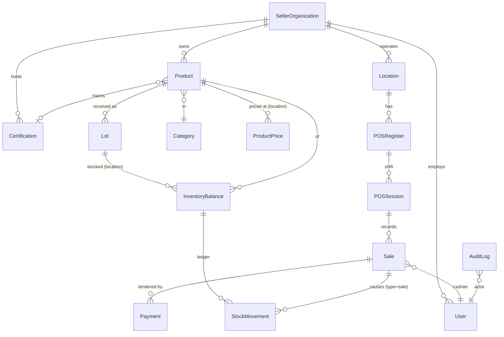
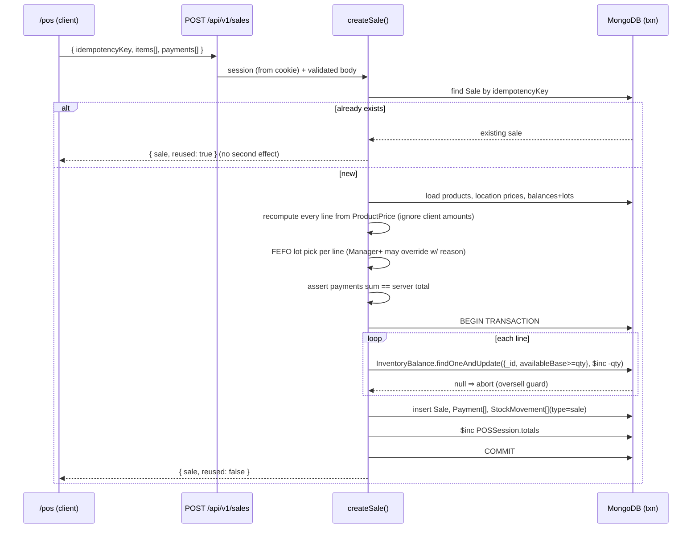

> Proposed offline extension (2026-09-13): [Offline POS proposal](docs/OFFLINE-POS-PROPOSAL.md). This is a phased design, not a statement of implemented billing behavior.

> Historical reference. The current PostgreSQL architecture is documented in `cross-platform-assets/project-context.md`.

# KOMOLA Organic POS — Project Context

## Offline POS implementation tracker

This tracker records the offline-first POS work so implementation can continue without losing context. The aim is to let sellers complete cash/product-based selling when the internet is slow or unavailable, then sync safely when the connection returns.

### Implemented

- Offline product catalogue is saved per user, organization, and location in browser IndexedDB.
- Saved products can be searched and browsed while offline.
- Product reads fall back to the saved catalogue during offline/server-unavailable states.
- Product create/edit remains online-only so the app does not pretend catalogue mutations were saved.
- Offline cash sales can be created from eligible saved products.
- Offline sales preserve browser transaction time, customer details, cash received, change, local receipt number, and idempotency key.
- Local stock is reduced immediately for pending offline sales on the same device.
- Offline sales are queued with statuses including pending, retry, blocked, synced, cancelled, and auth-required.
- Automatic sync runs when the seller workspace is opened, when the browser comes online, and after offline sale changes.
- Synced offline sales leave the active queue; blocked/cancelled/synced states are retained long enough for recovery and cleanup.
- Blocked sale rows show automatic check reasons and support customer correction, retry, and local cancellation.
- Backend `POST /api/v1/pos/sync/sales` accepts offline sale operations, preserves actual offline sale time, uses idempotency, supports walk-in cash customers, and returns per-operation outcomes.
- Server-side stock conflicts now return product-level detail, such as required quantity versus available server quantity.
- Offline sale sync refreshes the saved product catalogue before syncing and again after successful sync, keeping cached stock closer to the server.

### Remaining work

1. Recheck blocked/pending offline sales against refreshed stock before syncing, keeping only true conflicts blocked.
2. Add local sale detail/receipt view so a seller can open, verify, and print/show a pending offline receipt.
3. Update offline receipt after sync with the server sale number while preserving the local receipt reference.
4. Merge offline pending/synced sales into dashboard and recent-sales views so session totals feel consistent during weak internet.
5. Improve cash drawer/session reconciliation to clearly include pending offline cash and synced server cash.
6. Add conflict repair for unavailable products: edit quantity, remove a line, or cancel the local sale.
7. Add safer cleanup policy for old synced/cancelled records and a recovery/export path before deletion.
8. Document multi-device limits: offline stock is reliable per device only; the server remains final authority when devices reconnect.
9. Add broader tests for blocked-sale recheck, repair, receipts, dashboard totals, and cleanup.

### Current next task

Recheck blocked and pending offline sales after product refresh: if refreshed server stock means a sale can now sync, retry it automatically; if it still cannot sync, keep the exact reason visible and prepare repair actions such as quantity edit or line removal.


> **⚠️ Partly superseded (2026-09).** Sections 2 (architecture), 3 (roles /
> `pos_token`) and 5–8 describe the earlier embedded-Mongoose "thin vertical
> slice". This app now has **no database and no local JWT**: `go-api-backend`
> owns every read/write and authentication is **Supabase Auth** via
> `@supabase/ssr`. `shared/models/mongodb/*` and the `pos_token` cookie no
> longer exist. The current architecture, data model and seller-tenancy design
> are in `go-api-backend/docs/pos-architecture.md`,
> `go-api-backend/docs/authentication.md` and `go-api-backend/schemas/pos/`. The
> purpose (§1), organic-trust intent (§4) and deferred-scope list (§9) still
> read true.

## 1. Purpose

A focused **seller-side** POS for verified-organic sellers (Brands, FPOs, individual
farmers) and their outlet managers / cashiers in Visakhapatnam. It records sales,
reconciles payments, tracks organic lots and inventory, and gives each seller day-end
information. It is **not** a customer marketplace, delivery system, procurement ERP or
forecasting system — those integrate later behind clean interfaces.

This repository currently contains a **thin vertical slice** (see `DECISIONS.md`).

## 2. Architecture

```
Browser (client components)
   │  typed API client  ── shared/lib/api/*  (the ONLY fetch boundary)
   ▼
Next.js route handlers  ── app/api/v1/*
   │  Zod validate → guard (session, role, tenant) → service
   ▼
Server services  ── shared/services/*   (business rules; reused across routes + seed)
   ▼
Mongoose models  ── shared/models/mongodb/*   (interfaces separate: shared/interfaces/mongodb/*)
   ▼
MongoDB (replica set)
```

Rules carried from the KOMOLA starter (`farmers-republic/starter.md`):

- All reusable code under `shared/`; route code under `app/`.
- Every route calls `await mongoDB()` before any DB op; responses use `success()/failure()`.
- Interfaces (`_id?: string`, string ID refs) are separate files from models; models use the
  `mongoose.models.X || mongoose.model(...)` singleton with an explicit `Model<IX>` type.
- Money = integer **paise**. Inventory = integer **base units** (`g` / `ml` / `count`);
  the sale unit (`kg`, `l`, `piece`, `bunch`, `pack`, …) is stored separately on the product.
- Semantic design tokens only; `lucide-react` only; `cx()` for classNames.

### The API-client boundary (future Go/Gin migration)

`shared/lib/api/client.ts` builds every request from `NEXT_PUBLIC_API_BASE_URL`
(empty ⇒ this app's `/api/v1`). Each resource module (`auth`, `products`, `lots`,
`inventory`, `registers`, `sales`, `categories`) exposes typed functions returning
`ApiResult<T>`. To move onto the central KOMOLA Go/Gin service:

1. Set `NEXT_PUBLIC_API_BASE_URL` to the Go service.
2. If its envelope differs, adapt `normalize()` in `client.ts` (or add per-module adapters).

No component or page changes. The response envelope (`{ success, message, data }`) and the
resource surface are already close to `go-api-backend`'s conventions.

## 3. Roles & multi-tenancy

Two separate concepts:

- **`SellerOrganization.type`** — `Brand` | `FPO` | `Farmer`
- **`User.role`** — `Admin` | `Owner` | `Manager` | `Cashier` | `InventoryManager` (capitalised)

| Role | In this slice |
|---|---|
| `Admin` | platform user, no org scope (`orgId: ""`); not tenant-filtered |
| `Owner` | full control of their org's products, prices, lots, registers, sales |
| `Manager` | products, lots, prices, sessions, lot overrides for assigned locations |
| `Cashier` | open/close assigned register, create sales, hold/resume carts |
| `InventoryManager` | receive lots / stock movements; no user or verification management |

**Tenant scope is always derived from the session** (`orgId`, `locationId` in the JWT),
never from the request body or query string. `app/api/v1/utils/guard.ts` provides
`requireSession`, `requireRole`, `tenantFilter`. Every query is filtered by the session
`orgId`; role checks run server-side in addition to any UI gating.

## 4. Organic trust model

`Certification` records support schemes `NPOP`, `PGSIndia`, `InConversion`,
`OtherCertified`, `PendingVerification`, `Expired`, `Rejected` and a
`verificationStatus` (`PendingVerification` | `Approved` | `Rejected` | `Expired`) with
verifier, timestamp, notes, validity window, document URL/metadata and an audit `history[]`.

A product is only "verified organic" when its certificate is `Approved` **and** within its
validity window. At **lot receipt** and again at **sale time** the relevant claim is
snapshotted (`certificationSnapshot` on the lot; `items[].organic` on the sale) so historic
receipts stay accurate if the product or certificate later changes.

> The admin verification queue, expiry reminders and hard sale-time blocking of unverified
> products are deferred in this slice; the data model already carries everything they need.

## 5. Domain model



Key modelling points:

- `InventoryBalance` is unique on `(locationId, productId, lotId)` and is the target of
  **atomic conditional decrements** at sale time (`availableBase: { $gte: qty }`).
- `StockMovement` is **append-only** (`opening` | `receipt` | `sale` | `return` |
  `transfer` | `wastage` | `correction`).
- `Sale.idempotencyKey` is **unique**; `Sale.items[]` hold immutable snapshots (name, sku,
  barcode, unit, qtyBase, unitPrice, tax, discount, lotId, organic).
- `Payment` is payment **recording** only — method (`cash` | `upi` | `card`), amount in
  paise, optional operator-typed `upiRef`. No gateway.
- Products / users / orgs use status/archive fields; transaction history is never
  cascade-deleted.

## 6. Core workflow — a sale (`shared/services/sales.ts` → `createSale`)



- **Idempotency:** fast-path lookup by key; a lost `E11000` race re-reads and returns the
  winner. Retrying never creates a second sale, payment or decrement.
- **Server-authoritative money:** line totals come from `ProductPrice` (or the product
  `basePricePaise` fallback) and the product tax rate — never from the client.
- **Oversell impossible online:** the `$gte` guard inside the transaction fails the whole
  sale if stock moved underneath it.

## 7. Register open / close (`shared/services/registers.ts`)

- Open: one `POSSession` per register (`status: "open"`), enforced by a partial unique
  index plus a service check; records `openingCashPaise`.
- Running totals (`totals.cashSalesPaise`, `upiSalesPaise`, `saleCount`, …) are `$inc`-ed
  inside the sale transaction.
- Close: `expectedCashPaise = opening + cashSales − refunds + cashIn − cashOut`; cashier
  enters `countedCashPaise`; `variance = counted − expected`; a note is **required** when
  `|variance| > POS_CASH_VARIANCE_NOTE_THRESHOLD_PAISE`.

## 8. Security & privacy

- Zod validation on every mutating route; whitelisted updatable fields on `PATCH`
  (raw body is never `$set`).
- Tenant scope + RBAC enforced in `guard.ts`, not just the UI.
- bcrypt password hashes; secure `httpOnly`, `sameSite=lax` cookie.
- Search input is regex-escaped before use.
- Customer name/phone are optional; marketing consent is a separate boolean.
- `AuditLog` rows for sale creation and register open/close (actor, org, location,
  before/after summary).
- Errors never leak stack traces (`failure()` only surfaces `error` detail in development).

## 9. Deferred (documented, not faked)

Offline PWA + Dexie + `sync/batch`; reporting + CSV; admin `/admin/*` verification queue;
returns & corrections UI; certification expiry reminders and hard sale-time blocking;
Upstash rate limiting (login guard is a documented no-op fallback); Playwright e2e;
team/settings pages; scheduled prices; split-across-lots for a single line.
