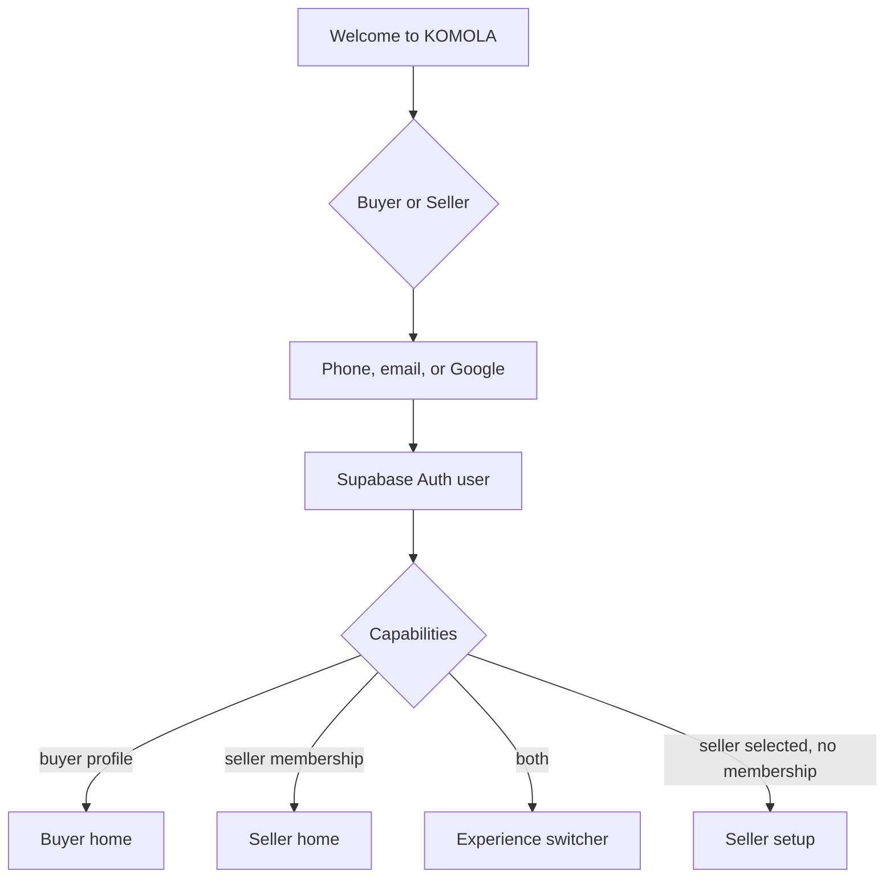
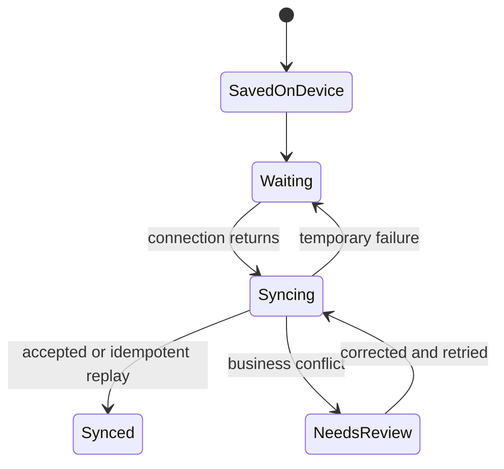
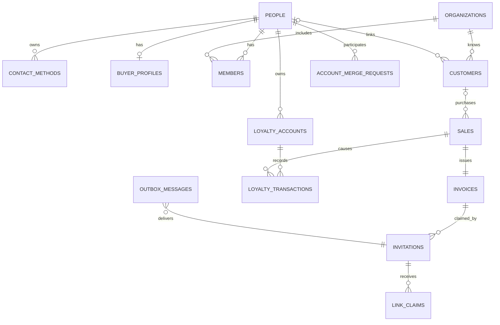

# KOMOLA identity, invoicing and rewards design

Status: **major architecture finalized; implementation awaits the eight policy
choices still listed in section 15.** Prepared 8 September 2026.

KOMOLA uses one Supabase Auth identity, PostgreSQL for all business data, and the
Go API as the only application-data authority. Redis may improve delivery or rate
limiting, but identity, sale, invoice, claim and reward correctness cannot depend
on it.

## 1. Reference-screen audit

The 33 images in `pos-zoho` show a back-office POS console rather than the daily
billing terminal. Useful patterns are the persistent navigation, scan-first item
lookup, customer list, register sessions, conflict queue, and lifecycle diagrams.
KOMOLA should adopt those concepts with fewer controls and plain language.

The references also show patterns that do not suit first-time farmers: dense
accounting forms, nested preferences, receivables language, multi-step invoice
states, and many simultaneous actions. KOMOLA should use large actions, one task
per screen, anonymous checkout by default, and status labels that explain what
will happen next. No Zoho colors, branding, spacing system, or layout is copied.

## 2. Shared authentication flow

There is one `/login` page and one Supabase Auth user. A **Buyer / Seller** tab
sets the intended destination and registration copy; it never creates a second
authentication system.



An invitation token survives redirects and registration in an HttpOnly,
SameSite=Lax cookie containing only an opaque token. After sign-in, the server
requires proof of the invitation destination before it attaches anything.

Buyer entry actions: sign in, register, open invitation, scan seller/invoice QR,
recover an account, view invoices, show buyer code, and view points. Seller entry
actions: sign in, register, finish stall setup, open POS, and view pending links.

## 3. Seller checkout and buyer identification

Checkout starts anonymous. **Identify buyer** opens a sheet with:

1. Scan buyer code.
2. Enter short code.
3. Enter WhatsApp phone.
4. Enter email.
5. Continue without buyer.

A verified buyer claim immediately associates the sale with the buyer identity.
A phone or email creates a provisional customer and, after the sale commits, an
invitation request. Failure to deliver never fails checkout. The success screen
shows **Send invoice**, delivery state, and **Continue without buyer** remains
available at every point.

## 4. Buyer and seller codes

Buyer and seller **profile QR codes are persistent discovery codes**. They use
opaque, rotatable public codes such as `BYR-K8M4X2` and `SLR-Q7N5P9`; contain no
database ID or contact detail; and may be revoked. They resolve only safe public
profile information. Possessing one does not authenticate the holder or authorize
invoice ownership, account linking, refund approval, or prize redemption.

Checkout identification is a separate, signed, short-lived claim:

```json
{
  "v": 1,
  "ref": "opaque-random-reference",
  "purpose": "buyer-identification-for-sale",
  "iat": 1788800000,
  "exp": 1788800300,
  "nonce": "128-bit-random-value",
  "kid": "signing-key-id"
}
```

The server signs the canonical payload with an asymmetric key. The QR contains
the payload and signature; the six-character short code maps to the same claim.
It never contains database IDs or contact details. Its expiry is configurable
and its nonce is consumed once per sale.

Seller profile codes may resolve the organization, public compliance status,
location, and optional terminal. Starting an invoice claim from that page creates
a separate single-use claim. Persistent discovery codes never transfer ownership.

## 5. Journey: buyer exists, seller does not

```mermaid
sequenceDiagram
  actor B as Buyer
  actor S as Seller
  participant API as KOMOLA API
  B->>API: Create seller invitation claim
  API-->>B: Signed QR + short code
  S->>API: Open claim and create provisional seller
  S->>API: Submit invoice with stable client ID
  API-->>B: Invoice waiting for review
  B->>API: Accept invoice
  API->>API: Attach purchase; create pending reward
  API-->>S: Prompt full seller registration
```

Offline, the buyer creates the signed claim while last online. The seller stores
the invoice, claim reference, and idempotency key locally. Synchronization accepts
the invoice once; rewards remain pending until the seller and transaction satisfy
server rules. Receipts label the seller as unverified, provisional, verified, or
verified organic.

## 6. Journey: seller exists, buyer does not

The seller completes the sale first. In one database transaction the API creates
the sale, invoice, provisional customer relationship, pending reward entitlement,
single-use invitation, and outbox message. A worker later sends WhatsApp or email.
The buyer opens the link, signs in or registers, verifies the original destination,
and claims the invoice. The receipt remains valid if the invitation is never used.

## 7. Cross-channel claims, duplicates, and recovery

For a phone invitation opened after email or Google registration, KOMOLA sends an
OTP to the invited phone. Only after successful verification does it add the
phone contact method and atomically claim the invoice. Email invitations follow
the equivalent verified-email flow.

If the verified destination already belongs to another person, return neutral
copy: **“This invoice needs account recovery before it can be added.”** Do not
reveal the other account. Preserve the invoice and rewards, require authentication
of both identities for linking, or create a merge-review request.

Merging locks both people, moves profile references without rewriting financial
or reward ledger history, preserves seller memberships, creates an alias from the
retired person, and records before/after audit data. Conflicting organizations or
privileged roles require administrative review.

## 8. Offline state model

IndexedDB stores terminal identity, current shift, cached catalogue/prices/stock,
completed sales, provisional customers, invitation requests, invoice claims,
pending reward estimates, receipts, and one synchronization outbox. Every queued
operation has a client UUID, idempotency key, dependency IDs, attempt count, and
local timestamp.



Persistent profile codes may be scanned offline only to retain the opaque code;
the profile is resolved after reconnection. Transaction claims may be used only
within their signed expiry. OTP verification,
message delivery, final ownership linking, reward confirmation, and redemption
require connectivity. The UI says **Invoice waiting to sync** and never says a
message was sent until the delivery provider acknowledges it.

## 9. Invoice lifecycle

Invoice ownership and payment status are separate.

`anonymous → provisionally_associated → claimed` is the normal ownership path.
`disputed` pauses rewards. `reassigned` requires verified recovery and audit.
`voided`, `partially_refunded`, and `refunded` reflect sale corrections.

Claiming runs in one transaction: lock invitation; validate state, expiry, attempts,
and verified destination ownership; lock invoice; attach buyer; upsert the
organization customer relationship; attach or create the reward entry; mark the
invitation claimed; write audit event; commit. Repeating the request returns the
same result without another ownership or reward mutation.

## 10. Reward and prize lifecycle

Rewards use an append-only ledger. Entries are `pending`, `available`, `redeemed`,
`reversed`, `expired`, or `disputed`. A balance is a projection, never the source
of truth. Every buyer has one platform-wide account across all sellers and
locations. Every entry retains its seller organization, location, sale, invoice,
refund/reversal, and reward-rule version. Sellers cannot edit balances.

One point is earned for each cumulative 10,000 eligible paise. A transactional
account projection stores `available_points`, `pending_points`,
`eligible_spend_remainder_minor`, `lifetime_points_earned`,
`lifetime_points_redeemed`, and `version`. Integer division determines newly
earned points and the modulus becomes the carried remainder; floating point is
never used. The unique earn key is `(sale_id, rule_version, entry_kind)`.

An anonymous sale has an unowned entitlement. Creating an invitation records a
pending entitlement. A verified claim assigns it to the buyer. The configured
availability policy moves points to available. Refunds and voids append reversals
that reference the original earn entry. If earned points were already spent, the
account enters a recoverable negative state and prize redemption is blocked until
recovery; customer copy explains the recovery without showing a raw negative
number. Offline screens show estimates and cannot redeem prizes.

Admins manage prizes with name, description, private image reference, external
information link, points required, active window, terms, per-customer limit, and
eligible locations. Inventory is held per location. Redemption atomically locks
the reward account and location inventory, validates points, dates, eligibility,
limit and stock, appends a points debit, decrements stock, creates the redemption
and audit events, and commits. An idempotency key prevents duplicate redemption.

Post-sale refunds and cancellations require online customer OTP approval. The
server challenges only the protected destination, records the authorizer, then
atomically reverses payment/inventory effects and appends reward reversals while
preserving the original invoice. Offline terminals may queue a refund request but
cannot restore stock, money, or points. An exchange is a return against the
original sale followed by a new sale and invoice.

## 11. PostgreSQL entity proposal



Add `identity.people`, `identity.contact_methods`, `identity.buyer_profiles`,
`identity.invites`, `identity.link_claims`, `identity.account_merge_requests`,
`identity.person_aliases`, `identity.public_codes`, `billing.invoice_claims`,
`identity.organization_compliance`, `loyalty.reward_rules`, `loyalty.prizes`,
`loyalty.prize_locations`, `loyalty.prize_inventory`, `loyalty.redemptions`,
`loyalty.redemption_events`, `integration.messages`,
`integration.message_attempts`, and `integration.outbox`. Adapt `pos.customers` to
allow nullable `person_id` and protected provisional contact data. Adapt loyalty
accounts to belong to a person without organization scope; originating
organization and location remain mandatory on earning and reversal entries.

Contact methods store type, normalized value, encrypted value where retrieval is
needed, keyed lookup hash, verification state/time, Auth subject, primary flag,
source, and timestamps. Unique verified ownership is enforced with a partial
unique index on `(type, lookup_hash)` where verified and active.

Invitations store only a token hash, purpose, organization, invoice/sale,
destination type and protected/hash value, expiry, attempt limit/count, state,
and lifecycle timestamps. Integration outbox rows contain channel, template, protected
destination, payload, attempts, next attempt, provider ID, acknowledgement time,
and a unique deduplication key.

`identity.organization_compliance` is optional and nullable in the first release.
It stores legal identifiers, licence/certificate dates, verification state and
controlled private-object references. Documents and public object URLs are not
stored in PostgreSQL.

## 12. API contract proposal

All private routes use Supabase bearer authentication. Mutations accept an
`Idempotency-Key`; public token routes are narrowly rate limited.

| Method and path | Purpose |
|---|---|
| `GET /api/v1/me/capabilities` | Buyer profile and seller memberships for routing |
| `POST /api/v1/me/contact-methods/challenges` | Start phone/email verification |
| `POST /api/v1/me/contact-methods/verify` | Verify and attach contact method |
| `POST /api/v1/buyer-codes` | Create rotating buyer QR/short claim |
| `POST /api/v1/buyer-codes/resolve` | Resolve claim for authenticated seller checkout |
| `GET /api/v1/public/sellers/{code}` | Resolve safe seller/location public details |
| `POST /api/v1/seller-invitations` | Buyer invites a provisional seller |
| `POST /api/v1/pos/sales/{id}/invitations` | Create/resend buyer invitation after sale |
| `GET /api/v1/invitations/{token}` | Return safe purpose/state metadata |
| `POST /api/v1/invitations/{token}/open` | Record open idempotently |
| `POST /api/v1/invitations/{token}/verify` | Start/complete destination proof |
| `POST /api/v1/invitations/{token}/claim` | Atomically claim invoice and reward |
| `GET /api/v1/buyer/invoices` | Authenticated buyer invoice list |
| `GET /api/v1/buyer/invoices/{id}` | Buyer-owned invoice detail |
| `GET /api/v1/buyer/rewards` | Available/pending totals and ledger page |
| `GET /api/v1/loyalty/prizes?locationId=` | Eligible active prizes and stock |
| `POST /api/v1/loyalty/redemptions` | Atomically redeem a prize at a location |
| `POST /api/v1/pos/sales/{id}/refund-challenges` | Start customer refund OTP |
| `POST /api/v1/pos/sales/{id}/refunds` | Verify OTP and complete refund |
| `POST /api/v1/account-links` | Begin recent-auth account linking |
| `POST /api/v1/account-merge-requests` | Create reviewed duplicate-resolution case |
| `GET /api/v1/pos/invitations` | Seller pending/claimed delivery status |

Errors use stable codes such as `INVITATION_EXPIRED`, `DESTINATION_VERIFICATION_REQUIRED`,
`INVITATION_ALREADY_CLAIMED`, and `ACCOUNT_RECOVERY_REQUIRED`; client copy remains
plain and does not reveal whether another identity exists.

## 13. Security and privacy review

- Store token hashes and compare in constant time; raw invitation tokens appear
  only once in the delivered URL.
- Use at least 128 bits of randomness, short expiry, single use, attempt limits,
  replay detection, key rotation via `kid`, and purpose-bound signatures.
- Normalize phone to E.164 and email to trimmed lowercase before hashing. A match
  is only a lookup candidate until that contact is verified.
- Encrypt retrievable destinations with envelope encryption; use a separate keyed
  hash for lookup. Never log raw tokens, OTPs, phone numbers, or emails.
- Apply authorization by person, membership, organization, invoice ownership, and
  invitation purpose. Seller members cannot browse platform-wide buyer data.
- Rate-limit token opens, code resolution, OTP issuance, verification attempts,
  and recovery. Responses and timing should avoid account enumeration.
- Require recent authentication for adding/removing login methods and merging.
- Record immutable audit events for verification, claim, reassignment, merge,
  privileged access, reward state changes, and delivery outcomes.
- Outbox workers claim rows with `FOR UPDATE SKIP LOCKED`; provider callbacks are
  authenticated and idempotent. Sending never occurs in a sale transaction.
- Define retention for provisional contacts, expired tokens, delivery payloads,
  and audit records; provide buyer export/deletion while retaining statutory
  financial records under a pseudonymous identity when required.

## 14. Responsive wireframes

### Shared login — phone

```text
┌──────────────────────────────┐
│          KOMOLA              │
│      Welcome to KOMOLA       │
│  ┌────────┐ ┌────────┐       │
│  │ Buyer  │ │ Seller │       │
│  └────────┘ └────────┘       │
│  Phone or email              │
│  [________________________]  │
│  [ Continue               ]  │
│  [ G  Continue with Google]  │
│  Register · Recover account  │
└──────────────────────────────┘
```

### Seller checkout — tablet/desktop

```text
┌─────────┬────────────────────────────┬──────────────────────┐
│ Sell    │ Search or scan [________]  │ Current sale         │
│ Sales   │ [Tomato] [Rice] [Mango]    │ 2 kg Tomato   ₹80    │
│Products │ [Oil   ] [Dal ] [Spinach]  │ 1 Rice bag    ₹55    │
│ Stock   │                            │ Total         ₹135   │
│Register │                            │ [Identify buyer]     │
│ More    │                            │ [Pay ₹135]           │
└─────────┴────────────────────────────┴──────────────────────┘
```

### Buyer identification — phone

```text
┌──────────────────────────────┐
│ Identify buyer          ×    │
│ [ Scan buyer code          ] │
│ [ Enter short code         ] │
│ [ WhatsApp phone           ] │
│ [ Email                    ] │
│                              │
│ [ Continue without buyer   ] │
└──────────────────────────────┘
```

### Buyer home and receipt — phone

```text
┌──────────────────────────────┐  ┌──────────────────────────────┐
│ Hello, Meera                 │  │ Green Farm · Verified       │
│ Available points       120   │  │ Invoice KML-1042            │
│ Pending points          15   │  │ Tomatoes 2 kg          ₹80  │
│ [Show my code] [Scan]        │  │ Rice 1 bag              ₹55  │
│ Recent purchases             │  │ Total                   ₹135 │
│ Green Farm       ₹135   >    │  │ Points 13 · Pending         │
│ Village Stall     ₹80   >    │  │ [Share] [Download] [Report] │
└──────────────────────────────┘  └──────────────────────────────┘
```

On mobile, seller navigation is a fixed bottom bar and checkout uses a cart
sheet. Tablet and desktop use a left rail and persistent cart. All primary touch
targets are at least 48 px, states use text plus icons, and critical screens are
available in English and Telugu.

## 15. Remaining product decisions

1. Are taxes part of eligible reward spending?
2. Do discounts reduce eligible spending? Proposed default: yes.
3. Are points available immediately or after a return window?
4. Can prizes be redeemed only at their configured physical locations?
5. Can a recoverable negative balance be cleared through future earning?
6. May Owner, Manager and Cashier initiate refund OTP, or only Owner/Manager?
7. What recovery path applies when the original sale has no buyer phone or email?
8. How long is a refund OTP valid? Proposed default: five minutes with limited
   attempts.

Messaging-provider selection remains deferred by design. The integration boundary
is provider-neutral and supports WhatsApp, email, and a future SMS channel.

## 16. Acceptance coverage and implementation order

Each of the 15 acceptance scenarios becomes an API integration test plus a UI
journey test. Security tests cover token replay, expiry, revocation, attempt
exhaustion, neutral duplicate responses, cross-organization access, and concurrent
claims. Offline tests restart the browser between enqueue and replay and assert
one sale, one invoice ownership link, and one reward earn entry.

Implementation order:

1. PostgreSQL identities, verified contacts, invitations, claims, reward ledger,
   audit events, and transactional outbox.
2. Auth capabilities and shared Buyer/Seller entry point.
3. Seller Identify buyer flow and anonymous/provisional checkout.
4. Invitation verification and cross-channel atomic claim.
5. Buyer dashboard, invoices, buyer/seller codes, and reward views.
6. IndexedDB outbox, offline claims, replay, and conflict UX.
7. Reviewed account linking/merge tooling and delivery-provider workers.

The schema and endpoint names in this document are the implementation contract
proposal. Runtime migrations and APIs should begin after section 15 is resolved,
because eligibility, availability, redemption and refund authorization rules
affect financial constraints and state transitions that are expensive to reverse.
